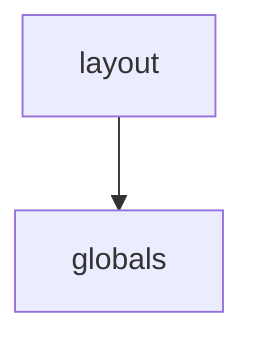

# Legal Buddy Implementation Analysis Report

## Feature Implementation Status

Total Features: 15
Fully Implemented: 0
Partially Implemented: 0
Not Started: 15
Overall Coverage: 0.0%
High Priority Coverage: 0.0%

## Feature Details

### SmartFormFilling (F1)
- Status: Not Started
- Priority: High
- Coverage Score: 0.0%

### TemplateLibrary (F2)
- Status: Not Started
- Priority: High
- Coverage Score: 0.0%

### VersionControl (F3)
- Status: Not Started
- Priority: High
- Coverage Score: 0.0%

### OCRProcessing (F4)
- Status: Not Started
- Priority: High
- Coverage Score: 0.0%

### BatchProcessing
  
  CASE_MANAGEMENT: (F5)
- Status: Not Started
- Priority: High
- Coverage Score: 0.0%

### TimelineTracking (F6)
- Status: Not Started
- Priority: High
- Coverage Score: 0.0%

### PartyManagement (F7)
- Status: Not Started
- Priority: High
- Coverage Score: 0.0%

### EvidenceTracking (F8)
- Status: Not Started
- Priority: High
- Coverage Score: 0.0%

### DeadlineCalculator (F9)
- Status: Not Started
- Priority: High
- Coverage Score: 0.0%

### AutomatedReminders
  
  AI_FEATURES: (F10)
- Status: Not Started
- Priority: High
- Coverage Score: 0.0%

### DocumentAnalysis (F11)
- Status: Not Started
- Priority: High
- Coverage Score: 0.0%

### CitationChecking (F12)
- Status: Not Started
- Priority: High
- Coverage Score: 0.0%

### RiskAssessment (F13)
- Status: Not Started
- Priority: High
- Coverage Score: 0.0%

### PrecedentSearch (F14)
- Status: Not Started
- Priority: High
- Coverage Score: 0.0%

### AutomatedDrafting (F15)
- Status: Not Started
- Priority: High
- Coverage Score: 0.0%

## Component Dependencies

## Technical Debt Summary

### Missing Scripts (Severity: High)
- Description: Lack of production build, test, and deployment scripts
- Remediation: Add comprehensive script coverage for all development lifecycle phases

### Dependency Management (Severity: Medium)
- Description: No lock file management or version control strategy defined
- Remediation: Implement package version locking and update strategy

### Development Workflow (Severity: Medium)
- Description: Limited development workflow automation
- Remediation: Add lint, format, and pre-commit hook scripts

### missing_extensions (Severity: High)
- Description: Critical development extensions for TypeScript, React, and testing are missing
- Remediation: Add recommended extensions for the Next.js tech stack including TypeScript, React, ESLint, and Prettier

### configuration_gaps (Severity: Medium)
- Description: Limited extension recommendations may impact development efficiency
- Remediation: Expand extension recommendations based on project requirements and development workflow needs

### Configuration (Severity: Medium)
- Description: Heavy reliance on unstable Deno features could cause future compatibility issues
- Remediation: Review and minimize use of unstable features, document why each is necessary

### Documentation (Severity: Low)
- Description: Lack of comments explaining the purpose of enabled unstable features
- Remediation: Add documentation for each unstable feature explaining its necessity

### Limited Analysis Depth (Severity: High)
- Description: Current implementation only tracks processed files without detailed analysis
- Remediation: Implement comprehensive analysis metrics and detailed reporting

### Error Handling (Severity: Medium)
- Description: Basic error tracking with failed_files but no detailed error information
- Remediation: Add detailed error tracking and recovery mechanisms

### Data Structure (Severity: Medium)
- Description: Simple JSON structure lacks necessary fields for complete analysis tracking
- Remediation: Expand data structure to include detailed analysis metrics and results

### Analysis Coverage (Severity: High)
- Description: Limited scope of code analysis with missing critical features
- Remediation: Implement comprehensive analysis pipeline with AI integration

### Quality Metrics (Severity: High)
- Description: Insufficient depth in code quality assessment
- Remediation: Add detailed quality metrics and automated analysis tools

### Feature Detection (Severity: Medium)
- Description: Basic feature detection lacking sophisticated analysis
- Remediation: Enhance feature detection with pattern recognition and AI assistance

### Missing Linting Rules (Severity: High)
- Description: ESLint configuration is minimal and lacks comprehensive rule sets for security, accessibility, and project-specific needs
- Remediation: Extend ESLint configuration with additional plugins and custom rules aligned with project requirements

### Configuration Documentation (Severity: Medium)
- Description: No documentation or comments explaining linting rule choices and enforcement rationale
- Remediation: Add detailed comments explaining rule selections and create a linting guide document

### Rule Coverage (Severity: Medium)
- Description: Current configuration only covers basic Next.js and TypeScript rules
- Remediation: Add additional rule sets for React best practices, security, and project conventions

### Configuration (Severity: High)
- Description: Missing essential Next.js configurations required for planned features
- Remediation: Add configurations for security, image optimization, API routes, and environment variables

### Security (Severity: High)
- Description: No security headers or CORS policies configured
- Remediation: Implement comprehensive security headers and CORS configuration

### Documentation (Severity: Medium)
- Description: Lack of configuration documentation and comments
- Remediation: Add detailed comments explaining configuration choices and their impacts

### missing_testing_framework (Severity: High)
- Description: No testing dependencies or configuration present
- Remediation: Add Jest, React Testing Library, and configure test scripts

### dependency_management (Severity: Medium)
- Description: Multiple UI component libraries may cause maintenance overhead
- Remediation: Consolidate UI component libraries to reduce overlap

### state_management (Severity: High)
- Description: Missing Redux implementation as specified in requirements
- Remediation: Implement Redux Toolkit and configure store structure

### Configuration (Severity: Medium)
- Description: Missing typography system configuration as specified in requirements
- Remediation: Add typography configuration including font families and scales

### Documentation (Severity: Low)
- Description: Limited inline documentation for custom color system usage
- Remediation: Add JSDoc comments explaining color system implementation and usage

### Scalability (Severity: Low)
- Description: Content paths could be more specific to avoid unnecessary scanning
- Remediation: Optimize content paths for better build performance

### Configuration (Severity: Medium)
- Description: Missing explicit strict null checks configuration
- Remediation: Add strictNullChecks: true to compiler options

### Testing (Severity: Medium)
- Description: No specific testing framework configuration
- Remediation: Add Jest types and testing patterns to TypeScript configuration

### Module Resolution (Severity: Low)
- Description: Using bundler moduleResolution which is relatively new
- Remediation: Consider using node moduleResolution for broader compatibility

### Security (Severity: High)
- Description: Missing authentication and authorization implementation
- Remediation: Implement comprehensive auth system following security requirements

### Configuration (Severity: Medium)
- Description: Hardcoded CORS settings and lack of environment configuration
- Remediation: Move configuration to environment variables and add proper CORS rules

### Testing (Severity: High)
- Description: No test coverage for API endpoints
- Remediation: Implement comprehensive test suite with pytest

### Documentation (Severity: Medium)
- Description: Missing API documentation and OpenAPI schemas
- Remediation: Add detailed API documentation and request/response schemas

### Schema Design (Severity: Medium)
- Description: Document metadata stored as JSONB without defined structure
- Remediation: Define specific metadata columns or create structured JSONB schema validation

### Data Model (Severity: High)
- Description: Missing relationships between documents and cases/matters
- Remediation: Create proper cases table and establish foreign key relationships

### Security (Severity: Medium)
- Description: Basic RLS policy might not handle complex access patterns
- Remediation: Implement more granular RLS policies based on user roles and document states

### Testing (Severity: High)
- Description: No automated tests implemented for storage setup script
- Remediation: Add unit tests for bucket creation and policy setup

### Error Handling (Severity: Medium)
- Description: Basic error handling could be more robust with retry mechanisms
- Remediation: Implement retry logic and more detailed error reporting

### Configuration (Severity: Low)
- Description: Hard-coded file size limits and MIME types
- Remediation: Move configuration to external config file for easier maintenance

### Testing (Severity: High)
- Description: No unit tests implemented for middleware functionality
- Remediation: Implement comprehensive test suite covering all authentication paths and edge cases

### Security (Severity: Medium)
- Description: Missing rate limiting and advanced security features
- Remediation: Implement rate limiting and additional security measures like request validation

### Documentation (Severity: Low)
- Description: Limited inline documentation for complex logic
- Remediation: Add detailed JSDoc comments explaining the authentication flow and decision points

### Testing (Severity: High)
- Description: No unit or integration tests implemented
- Remediation: Add comprehensive test suite using React Testing Library

### Error Handling (Severity: Medium)
- Description: Generic error messages in upload process
- Remediation: Implement detailed error handling and user-friendly error messages

### Type Safety (Severity: Low)
- Description: Some any types in metadata handling
- Remediation: Define strict TypeScript interfaces for metadata structure

### Testing (Severity: High)
- Description: No unit tests implemented for component
- Remediation: Add comprehensive test suite covering all main functionalities

### Error Handling (Severity: Medium)
- Description: Limited error state handling for missing or malformed data
- Remediation: Implement comprehensive error handling and fallback UI states

### Accessibility (Severity: Medium)
- Description: Missing ARIA labels and keyboard navigation
- Remediation: Add proper ARIA attributes and keyboard interaction handlers

### Testing (Severity: High)
- Description: No unit tests implemented for the component
- Remediation: Implement Jest tests for sorting, rendering, and interaction behaviors

### Performance (Severity: Medium)
- Description: Re-sorting on every event change could be optimized
- Remediation: Consider memoizing sorted results or implementing virtual scrolling for large datasets

### Accessibility (Severity: Medium)
- Description: Color-based entity differentiation might not be accessible
- Remediation: Add additional visual indicators besides color and ensure WCAG compliance

### Testing (Severity: Medium)
- Description: No unit tests implemented for the component
- Remediation: Add unit tests covering theme switching functionality and component rendering

### Documentation (Severity: Low)
- Description: Limited inline documentation and JSDoc comments
- Remediation: Add comprehensive JSDoc comments and prop type documentation

### Accessibility (Severity: Low)
- Description: Basic accessibility implementation could be enhanced
- Remediation: Add keyboard focus styles and enhance ARIA attributes

### Error Handling (Severity: Medium)
- Description: Generic error handling without specific error types
- Remediation: Implement custom error types and specific error handling

### Testing (Severity: High)
- Description: Lack of unit tests for processing steps
- Remediation: Add comprehensive unit tests for each processing step

### State Management (Severity: Low)
- Description: Local state management might not scale well
- Remediation: Consider implementing proper state management system

### Testing (Severity: High)
- Description: No unit tests implemented for critical document processing functions
- Remediation: Add comprehensive test suite with test cases for each pattern type

### Error Handling (Severity: Medium)
- Description: Limited error handling for edge cases in document processing
- Remediation: Add robust error handling and validation

### Performance (Severity: Medium)
- Description: Potential performance issues with large documents due to regex usage
- Remediation: Implement chunked processing and optimize regex patterns

### Error Handling (Severity: High)
- Description: Limited error handling and recovery mechanisms
- Remediation: Implement comprehensive error handling and retry mechanisms

### Testing (Severity: High)
- Description: Lack of unit tests and integration tests
- Remediation: Add comprehensive test suite covering all major operations

### Type Safety (Severity: Medium)
- Description: Some type definitions are loose or missing
- Remediation: Add strict type definitions for all functions and interfaces

### Configuration (Severity: Medium)
- Description: Hardcoded values and missing configuration management
- Remediation: Move configuration to environment variables and config files

### Documentation (Severity: Medium)
- Description: Lack of code documentation and type definitions
- Remediation: Add JSDoc comments and explicit type annotations

### Error Handling (Severity: High)
- Description: Missing error handling for database connection failures
- Remediation: Implement comprehensive error handling and connection management

### Testing (Severity: High)
- Description: No unit tests for database client initialization
- Remediation: Add unit tests for client initialization and connection handling

### Error Handling (Severity: Medium)
- Description: Generic error handling in connection validation could be more specific
- Remediation: Implement specific error types and handling for different failure scenarios

### Configuration (Severity: Low)
- Description: Hard-coded schema name in client configuration
- Remediation: Make schema name configurable via environment variables

### Testing (Severity: Medium)
- Description: Lacks comprehensive integration tests
- Remediation: Add integration tests covering all database operations and error scenarios

### documentation (Severity: Medium)
- Description: Missing function documentation and usage examples
- Remediation: Add JSDoc documentation with examples for the cn utility function

### testing (Severity: Medium)
- Description: No unit tests for class merging utility
- Remediation: Implement unit tests for various class merging scenarios

### type-safety (Severity: Low)
- Description: Relies on external type definitions from ClassValue
- Remediation: Consider adding explicit type definitions or validation

### validation (Severity: Medium)
- Description: No input validation or constraints defined for document properties
- Remediation: Add Zod or similar validation schema

### typing (Severity: Low)
- Description: Generic Record<string, any> used for metadata
- Remediation: Define specific metadata interface with expected fields

### documentation (Severity: Medium)
- Description: Missing JSDoc comments for interfaces and types
- Remediation: Add comprehensive JSDoc documentation for all types

### Type Definition (Severity: Medium)
- Description: Metadata field uses generic Json type instead of strongly typed interface
- Remediation: Create specific interfaces for different document type metadata

### Schema Evolution (Severity: Low)
- Description: Document types are hardcoded as string literals
- Remediation: Consider using an extensible enum pattern for document types

### Authentication (Severity: High)
- Description: Authentication check is currently mocked with hardcoded value
- Remediation: Implement proper authentication state management using NextAuth.js

### Error Handling (Severity: Medium)
- Description: No error handling for navigation or auth state changes
- Remediation: Add try-catch blocks and error states for navigation failures

### Testing (Severity: Medium)
- Description: No unit tests or integration tests implemented
- Remediation: Add comprehensive test suite for auth layout and routing logic

### Documentation (Severity: Low)
- Description: Limited inline documentation and type definitions
- Remediation: Add JSDoc comments and improve type annotations

### Testing (Severity: Medium)
- Description: No test implementation for layout component
- Remediation: Add Jest/React Testing Library tests for layout behavior

### Documentation (Severity: Low)
- Description: Missing component documentation and props interface
- Remediation: Add JSDoc documentation and TypeScript interface for props

### Error Handling (Severity: Medium)
- Description: No error boundary implementation
- Remediation: Implement React Error Boundary for graceful error handling

### Testing (Severity: High)
- Description: No unit or integration tests implemented
- Remediation: Add Jest/React Testing Library tests for components

### Content Management (Severity: Medium)
- Description: Hardcoded content throughout components
- Remediation: Implement CMS integration for dynamic content

### Accessibility (Severity: Medium)
- Description: Missing ARIA labels and keyboard navigation
- Remediation: Add proper accessibility attributes and keyboard handlers

### State Management (Severity: Medium)
- Description: Local state management may not scale well with increasing features
- Remediation: Implement proper state management solution (Redux/Context)

### Type Safety (Severity: Low)
- Description: Event interface could be more comprehensive
- Remediation: Expand type definitions and add validation

### Testing (Severity: High)
- Description: No tests implemented for calendar functionality
- Remediation: Add unit tests and integration tests for core calendar features

### Data Persistence (Severity: High)
- Description: No data persistence implementation
- Remediation: Implement API integration and data storage solution

### Missing State Management (Severity: High)
- Description: No implementation of Redux store for case management as specified in requirements
- Remediation: Implement Redux store with cases slice and necessary actions/reducers

### Missing Type Definitions (Severity: Medium)
- Description: No TypeScript interfaces defined for case data structures
- Remediation: Create comprehensive type definitions for case-related data

### Incomplete Component Structure (Severity: Medium)
- Description: Cases page should be split into smaller, reusable components
- Remediation: Refactor into smaller components for better maintainability and reusability

### Missing Tests (Severity: High)
- Description: No unit or integration tests implemented
- Remediation: Add comprehensive test suite using React Testing Library

### State Management Limitations (Severity: High)
- Description: Current context implementation is too basic for the required feature set
- Remediation: Consider implementing Redux or more robust state management solution

### Missing Type Definitions (Severity: Medium)
- Description: ExtractedItem interface is minimal and doesn't cover all required properties
- Remediation: Expand type definitions to match complete data model requirements

### Testing Infrastructure (Severity: High)
- Description: No test implementation for context and hooks
- Remediation: Implement comprehensive test suite using React Testing Library

### Error Handling (Severity: Medium)
- Description: Basic error handling only for context usage
- Remediation: Implement comprehensive error handling and error boundaries

### Testing (Severity: High)
- Description: No unit tests or component tests implemented
- Remediation: Implement Jest/React Testing Library tests for core components

### State Management (Severity: Medium)
- Description: Local component state only - needs proper state management
- Remediation: Implement Redux store for global state management

### Type Safety (Severity: Low)
- Description: Some props interfaces could be more strictly typed
- Remediation: Add stricter TypeScript interfaces and union types

### Error Handling (Severity: Medium)
- Description: Generic error handling could be more specific and user-friendly
- Remediation: Implement detailed error tracking and user-friendly error messages

### State Management (Severity: Medium)
- Description: Local state management could be refactored to use a more scalable solution
- Remediation: Consider implementing Redux or similar state management solution

### Performance (Severity: Low)
- Description: Document processing might cause performance issues with large files
- Remediation: Implement chunked processing and loading indicators

### Testing (Severity: High)
- Description: Lack of comprehensive testing for critical document processing functions
- Remediation: Add unit tests and integration tests for core functionality

### StaticData (Severity: High)
- Description: Currently using hardcoded mock data instead of API integration
- Remediation: Implement proper API integration and data fetching hooks

### TestingGap (Severity: High)
- Description: No unit or integration tests implemented
- Remediation: Add comprehensive test suite using React Testing Library

### ComponentStructure (Severity: Medium)
- Description: Large monolithic component could be broken down into smaller, reusable components
- Remediation: Extract card, transaction list, and payment method components into separate files

### StateManagement (Severity: Medium)
- Description: No proper state management implementation for financial data
- Remediation: Implement Redux or React Query for state management

### Static Content (Severity: Medium)
- Description: Hardcoded course data and progress metrics
- Remediation: Implement dynamic data fetching from API

### Missing Tests (Severity: High)
- Description: No unit or integration tests implemented
- Remediation: Add comprehensive test suite for component functionality

### Accessibility (Severity: Medium)
- Description: Missing ARIA labels and keyboard navigation
- Remediation: Implement proper accessibility features and keyboard controls

### Data Integration (Severity: High)
- Description: Currently using static mock data instead of real API integration
- Remediation: Implement API integration and state management

### Testing (Severity: High)
- Description: No test coverage for component functionality
- Remediation: Add unit tests and integration tests

### Component Structure (Severity: Medium)
- Description: Large monolithic component could be broken down
- Remediation: Split into smaller, reusable components

### Error Handling (Severity: Medium)
- Description: No error states or loading states implemented
- Remediation: Add error boundaries and loading states

### Static Data (Severity: High)
- Description: Component uses hardcoded mock data instead of dynamic content
- Remediation: Implement data fetching from backend API

### Missing Tests (Severity: Medium)
- Description: No unit or integration tests implemented
- Remediation: Add comprehensive test suite for component functionality

### Accessibility (Severity: Medium)
- Description: Missing ARIA labels and keyboard navigation
- Remediation: Implement proper accessibility features and keyboard controls

### State Management (Severity: Low)
- Description: Local component state only, no global state management
- Remediation: Integrate with global state management solution

### Testing (Severity: High)
- Description: No unit tests or integration tests implemented
- Remediation: Add comprehensive test suite using Jest and React Testing Library

### Error Handling (Severity: Medium)
- Description: Generic error messages for authentication failures
- Remediation: Implement specific error codes and user-friendly error messages

### Security (Severity: Medium)
- Description: Missing CSRF protection and rate limiting
- Remediation: Implement CSRF tokens and API rate limiting middleware

### Security (Severity: High)
- Description: Missing password strength validation and 2FA implementation
- Remediation: Implement password strength validation and 2FA support

### Testing (Severity: High)
- Description: No unit tests or integration tests implemented
- Remediation: Add comprehensive test suite for authentication flows

### Error Handling (Severity: Medium)
- Description: Basic error handling implementation could be more robust
- Remediation: Implement more detailed error handling and user feedback

### Documentation (Severity: Low)
- Description: Limited inline documentation for complex logic
- Remediation: Add JSDoc comments and improve code documentation

### Testing (Severity: High)
- Description: No unit tests implemented for component
- Remediation: Add Jest/React Testing Library tests for all components

### Asset Management (Severity: Medium)
- Description: Team member images not properly implemented
- Remediation: Implement proper image handling with Next.js Image component and actual assets

### Configuration (Severity: Low)
- Description: Hardcoded values throughout component
- Remediation: Move static content to configuration files or CMS

### Implementation (Severity: High)
- Description: Form submission logic is missing
- Remediation: Implement form submission handler and API integration

### Testing (Severity: Medium)
- Description: No unit tests implemented for components
- Remediation: Add unit tests for form validation and component rendering

### Documentation (Severity: Low)
- Description: Component props lack TypeScript interfaces
- Remediation: Add proper TypeScript interfaces for component props

### Testing (Severity: High)
- Description: No unit tests or integration tests implemented
- Remediation: Implement Jest/React Testing Library tests for components

### Accessibility (Severity: Medium)
- Description: Missing ARIA labels and keyboard navigation
- Remediation: Add proper ARIA attributes and keyboard handlers

### TypeScript (Severity: Low)
- Description: Some props lack proper TypeScript interfaces
- Remediation: Define proper interfaces for all component props

### Testing (Severity: High)
- Description: No unit tests or integration tests implemented
- Remediation: Add comprehensive test suite for all pricing components

### Type Safety (Severity: Medium)
- Description: Some prop types could be more strictly defined
- Remediation: Create dedicated interfaces for component props

### Accessibility (Severity: Medium)
- Description: Missing ARIA labels and keyboard navigation
- Remediation: Implement full accessibility features and conduct audit

### Responsiveness (Severity: Low)
- Description: Some mobile breakpoints could be optimized
- Remediation: Add more specific mobile-first styling

### UI/UX (Severity: High)
- Description: Raw JSON display of details field is not user-friendly
- Remediation: Implement proper formatting and display of activity details

### Performance (Severity: Medium)
- Description: No pagination implementation could lead to performance issues with large datasets
- Remediation: Implement server-side pagination with limit and offset

### Accessibility (Severity: Medium)
- Description: Table lacks proper accessibility attributes and keyboard navigation
- Remediation: Add ARIA labels and implement keyboard navigation support

### Documentation (Severity: Low)
- Description: Component lacks proper JSDoc documentation
- Remediation: Add comprehensive JSDoc comments explaining props and component behavior

### Error Handling (Severity: High)
- Description: No error handling implemented for failed Supabase queries
- Remediation: Implement try-catch block and error state handling

### Performance (Severity: Medium)
- Description: Hard-coded limit without pagination could cause performance issues with large datasets
- Remediation: Implement proper pagination with configurable page sizes

### Testing (Severity: High)
- Description: No unit or integration tests present
- Remediation: Add comprehensive test suite including error cases and data loading states

### Documentation (Severity: Medium)
- Description: Missing component documentation and type definitions
- Remediation: Add JSDoc comments and proper TypeScript interfaces

### Input Validation (Severity: High)
- Description: Minimal input validation implemented, potentially allowing invalid data
- Remediation: Implement comprehensive input validation using a validation library

### Error Handling (Severity: Medium)
- Description: Generic error messages and basic error handling
- Remediation: Implement detailed error handling with specific error codes and messages

### Testing (Severity: High)
- Description: No unit tests or integration tests present
- Remediation: Add comprehensive test suite covering all edge cases and error scenarios

### Documentation (Severity: Medium)
- Description: Limited inline documentation and no API documentation
- Remediation: Add JSDoc comments and API documentation

### security (Severity: High)
- Description: Endpoint potentially exposes sensitive configuration information without proper access controls
- Remediation: Add authentication middleware and limit exposed information

### testing (Severity: Medium)
- Description: No test coverage for the authentication test endpoint
- Remediation: Add unit tests and integration tests for the endpoint

### documentation (Severity: Medium)
- Description: Lacks inline documentation and API documentation
- Remediation: Add JSDoc comments and API documentation including expected responses

### error_handling (Severity: Medium)
- Description: No error handling for missing environment variables
- Remediation: Add proper error handling and validation for required environment variables

### Error Handling (Severity: High)
- Description: Minimal error handling implementation for document processing failures
- Remediation: Implement comprehensive error handling and recovery strategies

### Type Safety (Severity: Medium)
- Description: Some type definitions are incomplete or missing
- Remediation: Complete type definitions for all props and state

### Testing (Severity: High)
- Description: No unit tests or integration tests implemented
- Remediation: Add comprehensive test suite for core functionality

### Performance (Severity: Medium)
- Description: No loading state management for large documents
- Remediation: Implement chunked processing and progress indicators

### API Integration (Severity: High)
- Description: Currently using static sample data instead of real API integration
- Remediation: Implement proper API integration with error handling and loading states

### Type Safety (Severity: Medium)
- Description: Insufficient TypeScript type coverage for transcript data structure
- Remediation: Define comprehensive interfaces for transcript data and API responses

### Testing (Severity: High)
- Description: No unit or integration tests implemented
- Remediation: Add comprehensive test suite covering component rendering and user interactions

### Error Handling (Severity: Medium)
- Description: Basic error state implemented but lacks detailed error handling
- Remediation: Implement comprehensive error handling with user-friendly error messages and recovery options

### Data Management (Severity: High)
- Description: Using static sample data instead of proper API integration
- Remediation: Implement proper API client and data fetching logic

### Error Handling (Severity: Medium)
- Description: Basic error handling with no specific error states or recovery mechanisms
- Remediation: Implement comprehensive error handling and user feedback

### Testing (Severity: High)
- Description: No unit tests or integration tests present
- Remediation: Add comprehensive test suite including unit and integration tests

### TypeScript Usage (Severity: Low)
- Description: Some types could be more strictly defined
- Remediation: Enhance type definitions and add proper interfaces for all data structures

### Testing (Severity: High)
- Description: No unit tests implemented for component
- Remediation: Implement Jest/React Testing Library tests for core functionality

### Error Handling (Severity: Medium)
- Description: Missing error boundaries and loading states
- Remediation: Add error handling and loading states for async operations

### Accessibility (Severity: Medium)
- Description: Missing ARIA labels and keyboard navigation
- Remediation: Implement full keyboard navigation and ARIA attributes

### Data Fetching (Severity: High)
- Description: Currently using static mock data instead of real API integration
- Remediation: Implement proper data fetching using React Query or SWR

### Error Handling (Severity: Medium)
- Description: No error states or loading states implemented
- Remediation: Add error boundaries and loading states

### Type Safety (Severity: Low)
- Description: Email interface not properly typed
- Remediation: Define proper TypeScript interfaces for all data structures

### Data Management (Severity: High)
- Description: Using static sample data instead of proper API integration
- Remediation: Implement proper API client and data fetching

### Testing (Severity: High)
- Description: No unit tests or integration tests present
- Remediation: Add comprehensive test suite for component functionality

### Error Handling (Severity: Medium)
- Description: Basic error handling with no specific error cases
- Remediation: Implement detailed error handling and user feedback

### Documentation (Severity: Medium)
- Description: Limited inline documentation and type definitions
- Remediation: Add JSDoc comments and improve type documentation

### Incomplete Implementation (Severity: High)
- Description: Export functionality is only stubbed with console.log
- Remediation: Implement proper export functionality with progress tracking and format options

### Missing Error Handling (Severity: Medium)
- Description: No error handling for context operations or failed removals
- Remediation: Add try-catch blocks and error states for operations

### Missing Documentation (Severity: Medium)
- Description: Component lacks proper JSDoc documentation and type definitions
- Remediation: Add comprehensive JSDoc comments and improve type definitions

### Missing Tests (Severity: High)
- Description: No unit tests or integration tests present
- Remediation: Add comprehensive test suite covering component functionality

### Data Management (Severity: High)
- Description: Using static sample data instead of proper API integration
- Remediation: Implement proper API integration with error handling and loading states

### Testing (Severity: High)
- Description: No unit tests or integration tests implemented
- Remediation: Add comprehensive test suite including unit tests and integration tests

### Error Handling (Severity: Medium)
- Description: Basic error handling with no specific error messages or recovery options
- Remediation: Implement comprehensive error handling with specific error messages and recovery paths

### Type Safety (Severity: Medium)
- Description: Incomplete TypeScript type definitions for invoice data structure
- Remediation: Define proper interfaces for all data structures and enforce strict type checking

### API Integration (Severity: High)
- Description: Currently using mock data instead of real API integration
- Remediation: Implement proper API integration with error handling and loading states

### Testing (Severity: Medium)
- Description: No unit tests or integration tests present
- Remediation: Add comprehensive test suite covering core functionality

### Error Handling (Severity: Medium)
- Description: Basic error handling with generic error messages
- Remediation: Implement detailed error handling with specific error messages and recovery options

### TypeScript Types (Severity: Low)
- Description: Basic type definitions could be more comprehensive
- Remediation: Enhance type definitions with more specific interfaces and proper documentation

### Data Management (Severity: High)
- Description: Using static sample data instead of proper API integration
- Remediation: Implement proper API client and data fetching logic

### Error Handling (Severity: Medium)
- Description: Basic error state exists but lacks proper error handling and user feedback
- Remediation: Implement comprehensive error handling and user-friendly error messages

### Testing (Severity: High)
- Description: No unit tests or integration tests implemented
- Remediation: Add comprehensive test suite including unit and integration tests

### Feature Implementation (Severity: Medium)
- Description: Missing core document management features required by specifications
- Remediation: Implement missing document management features according to requirements

### API Integration (Severity: High)
- Description: Currently using mock data instead of real API integration
- Remediation: Implement proper API integration with error handling

### Error Handling (Severity: Medium)
- Description: Basic error handling implementation without proper user feedback
- Remediation: Add comprehensive error handling and user notifications

### Testing (Severity: High)
- Description: No unit tests or integration tests implemented
- Remediation: Add test suite covering core functionality and edge cases

### State Management (Severity: Medium)
- Description: Local state management could be improved with proper caching
- Remediation: Implement proper state management solution with caching

### Data Integration (Severity: High)
- Description: Using static sample data instead of real API integration
- Remediation: Implement proper API integration with error handling and loading states

### Testing (Severity: High)
- Description: No unit tests or integration tests implemented
- Remediation: Add comprehensive test suite covering component rendering and interaction

### Performance (Severity: Medium)
- Description: No pagination or virtualization for large message sets
- Remediation: Implement pagination or virtual scrolling for handling large datasets

### TypeScript (Severity: Low)
- Description: Incomplete type definitions for message set data structure
- Remediation: Define proper interfaces for all data structures used in the component

### Data Management (Severity: High)
- Description: Using static sample data instead of proper API integration
- Remediation: Implement proper API service layer and data fetching

### Testing (Severity: High)
- Description: No unit tests or integration tests implemented
- Remediation: Add comprehensive test suite covering core functionality

### State Management (Severity: Medium)
- Description: Local state management could be improved with proper caching and optimization
- Remediation: Implement proper state management solution (Redux/React Query)

### Error Handling (Severity: Medium)
- Description: Basic error handling implementation needs improvement
- Remediation: Implement comprehensive error boundary and error state handling

### testing (Severity: Medium)
- Description: No unit tests implemented for the Footer component
- Remediation: Add Jest/React Testing Library tests for navigation and responsive behavior

### accessibility (Severity: Low)
- Description: Missing ARIA labels and roles for better accessibility
- Remediation: Add appropriate ARIA attributes and roles to improve accessibility

### type-safety (Severity: Low)
- Description: No TypeScript interfaces defined for component props
- Remediation: Define interfaces for component props even if currently not using any

### Testing (Severity: High)
- Description: No unit tests implemented for header component
- Remediation: Add unit tests for navigation and mobile menu functionality

### State Management (Severity: Medium)
- Description: Local state used for mobile menu could be problematic with more complex requirements
- Remediation: Consider using a global state management solution if complexity increases

### Accessibility (Severity: Medium)
- Description: Missing ARIA labels and keyboard navigation improvements
- Remediation: Add comprehensive ARIA labels and keyboard navigation support

### Testing (Severity: High)
- Description: No unit tests implemented for layout component
- Remediation: Implement unit tests for layout logic and authentication flows

### Type Safety (Severity: Medium)
- Description: Some prop types could be more strictly defined
- Remediation: Create explicit interfaces for all props and state

### Performance (Severity: Low)
- Description: localStorage operations in render path
- Remediation: Move localStorage operations to effects or custom hooks

### Testing (Severity: High)
- Description: No unit tests implemented for component
- Remediation: Add comprehensive unit tests covering all navigation states and interactions

### State Management (Severity: Medium)
- Description: Navigation state managed by parent component could become complex with additional features
- Remediation: Consider implementing a dedicated navigation context or state management solution

### Accessibility (Severity: Medium)
- Description: Missing ARIA labels and keyboard navigation enhancements
- Remediation: Add proper ARIA attributes and keyboard navigation support

### Testing (Severity: High)
- Description: No unit tests implemented for the component
- Remediation: Add comprehensive test suite covering all user interactions and states

### Accessibility (Severity: Medium)
- Description: Missing ARIA labels and keyboard navigation improvements
- Remediation: Add proper ARIA labels and implement full keyboard navigation support

### Responsiveness (Severity: Medium)
- Description: Mobile-specific navigation features not implemented
- Remediation: Implement hamburger menu and mobile-optimized navigation

### Documentation (Severity: Medium)
- Description: Component lacks proper JSDoc documentation and usage examples
- Remediation: Add comprehensive JSDoc comments explaining props, usage, and examples

### Testing (Severity: High)
- Description: No unit tests or integration tests implemented
- Remediation: Implement unit tests for session management and integration tests for authentication flow

### Error Handling (Severity: Medium)
- Description: No explicit error handling for session failures
- Remediation: Implement error boundary and session recovery mechanisms

### Testing (Severity: Medium)
- Description: No unit tests implemented for theme functionality
- Remediation: Add unit tests for theme switching and system preference detection

### Documentation (Severity: Low)
- Description: Limited inline documentation and type descriptions
- Remediation: Add JSDoc comments and improve type documentation

### Configuration (Severity: Low)
- Description: Hardcoded default theme value
- Remediation: Move theme configuration to environment variables or configuration file

### Testing (Severity: High)
- Description: No unit tests implemented for button variants and interactions
- Remediation: Implement comprehensive test suite using React Testing Library

### Documentation (Severity: Medium)
- Description: Missing JSDoc documentation for component props and variants
- Remediation: Add detailed JSDoc comments explaining each prop and variant option

### Accessibility (Severity: Low)
- Description: Could benefit from explicit ARIA attributes for special button types
- Remediation: Add appropriate ARIA attributes for different button variants

### Testing (Severity: High)
- Description: No unit tests or integration tests implemented for dialog component
- Remediation: Implement comprehensive test suite covering all dialog states and interactions

### Documentation (Severity: Medium)
- Description: Limited inline documentation for component props and usage patterns
- Remediation: Add JSDoc comments and usage examples for all exported components

### Customization (Severity: Low)
- Description: Limited theme customization options beyond dark/light mode
- Remediation: Implement theme configuration system aligned with global style guide

### Testing (Severity: High)
- Description: No unit tests implemented for the input component
- Remediation: Add comprehensive unit tests covering different input states and interactions

### Documentation (Severity: Medium)
- Description: Limited JSDoc documentation for component props and usage
- Remediation: Add detailed JSDoc comments explaining component props, usage examples, and accessibility features

### Accessibility (Severity: Low)
- Description: Missing explicit aria labels and roles
- Remediation: Add appropriate aria attributes and roles for better accessibility support

### testing (Severity: Medium)
- Description: No unit tests or integration tests implemented for the tabs component
- Remediation: Add comprehensive test suite using React Testing Library

### documentation (Severity: Low)
- Description: Component props and usage examples not documented
- Remediation: Add JSDoc comments and usage examples in comments

### accessibility (Severity: Low)
- Description: No explicit ARIA labels or descriptions required from consumers
- Remediation: Add prop validation for accessibility attributes and documentation about required ARIA props

### Missing Tests (Severity: High)
- Description: No unit tests for authentication configuration
- Remediation: Add unit tests for environment variable validation and client initialization

### Documentation (Severity: Medium)
- Description: Limited inline documentation and JSDoc comments
- Remediation: Add comprehensive JSDoc comments explaining configuration options and usage

### Error Handling (Severity: Medium)
- Description: Basic error handling for environment variables only
- Remediation: Implement more robust error handling for client initialization and runtime errors

### Error Handling (Severity: High)
- Description: Basic console.error logging without proper error handling strategy
- Remediation: Implement structured error handling with proper error types and recovery mechanisms

### Testing (Severity: High)
- Description: No unit tests or integration tests present
- Remediation: Add comprehensive test suite for tracking functionality

### Documentation (Severity: Medium)
- Description: Lacks function and type documentation
- Remediation: Add JSDoc comments explaining function purpose, parameters, and return values

### Type Safety (Severity: Low)
- Description: Relies on implicit typing for some objects
- Remediation: Define explicit interfaces for all objects and function parameters

### Documentation (Severity: Medium)
- Description: Lack of inline documentation explaining configuration choices
- Remediation: Add JSDoc comments explaining each configuration option and its purpose

### Configuration (Severity: Medium)
- Description: Missing important Next.js configuration options for security and performance
- Remediation: Add configurations for security headers, image optimization, and API routes

### Testing (Severity: Low)
- Description: No configuration validation tests
- Remediation: Add tests to verify configuration integrity and expected behavior

### Code Smell (Severity: Medium)
- Description: Some components are tightly coupled, which can hinder scalability.
- Remediation: Refactor components to use dependency injection for better separation of concerns.

### Documentation (Severity: High)
- Description: Lack of comprehensive documentation for new features in the analytics module.
- Remediation: Create a dedicated documentation section for analytics features with usage examples.

### Lack of Error Handling (Severity: Medium)
- Description: The script only outputs errors for missing environment variables but does not capture other potential runtime exceptions.
- Remediation: Implement try-except blocks to handle exceptions during the PDF processing stage.

### Code Complexity (Severity: Medium)
- Description: The logic for processing PDFs and managing API responses is tightly coupled, making future enhancements more challenging.
- Remediation: Refactor the code for better separation of concerns and to adhere to single-responsibility principles.

### Code Duplication (Severity: Medium)
- Description: Similar code patterns in handling text extraction and annotation management.
- Remediation: Refactor code to use helper functions for repetitive tasks.

### Missing Unit Tests (Severity: High)
- Description: No unit tests are present for the AnnotationTool functionalities.
- Remediation: Implement unit tests to cover critical functionalities of the annotation tool.

### Documentation (Severity: Medium)
- Description: Lack of comprehensive inline comments and external documentation for certain models.
- Remediation: Add comments and documentation strings for methods and classes to improve understanding.

### Code Complexity (Severity: Medium)
- Description: The class handles multiple responsibilities such as PDF processing, case info extraction, and deadline management.
- Remediation: Consider breaking down the class into smaller, more focused classes or functions.

### Error Handling (Severity: High)
- Description: Current error handling is rudimentary and will not capture all edge cases.
- Remediation: Implement a comprehensive error handling strategy to gracefully manage unexpected situations.

### Code Complexity (Severity: Medium)
- Description: The code contains several nested loops and conditionals that make it difficult to follow.
- Remediation: Refactor code to use helper functions and improve readability.

### Lack of Unit Tests (Severity: High)
- Description: Significant parts of the functionality lack accompanying unit tests.
- Remediation: Create unit tests for all main functions, especially error handling scenarios.

### Code Complexity (Severity: Medium)
- Description: The async logic with potential multiple exceptions may complicate code flow and understanding.
- Remediation: Refactor the code to separate concerns, breaking larger functions into more manageable parts, and ensure that error handling is clearer.

### Lack of Tests (Severity: High)
- Description: The current implementation lacks unit tests to cover core functionalities, making it hard to validate behavior during changes.
- Remediation: Develop unit tests for PDF processing and storage functions to ensure reliability and facilitate future changes.

### code complexity (Severity: Medium)
- Description: Complex logic for data handling may cause issues in future maintenance.
- Remediation: Refactor the data handling code into smaller, reusable functions

### Lack of Tests (Severity: High)
- Description: No unit or integration tests present for functions.
- Remediation: Introduce test cases for each function to ensure robustness.

### Error Handling (Severity: Medium)
- Description: Insufficient error handling could lead to application crashes.
- Remediation: Add comprehensive error handling to manage potential exceptions during file operations.

### Documentation (Severity: High)
- Description: Lack of docstrings or comments explaining the classes and methods.
- Remediation: Add docstrings and comments to improve clarity and maintainability.

### Testing (Severity: High)
- Description: No unit tests available for the implemented components.
- Remediation: Implement unit tests for PDFProcessor and SupabaseHandler to ensure functionality.

### Code Complexity (Severity: High)
- Description: The case management module has high cyclomatic complexity, making it difficult to maintain.
- Remediation: Refactor the code to reduce complexity and improve readability.

### Outdated Dependencies (Severity: Medium)
- Description: Several dependencies are outdated and may pose security vulnerabilities.
- Remediation: Review and update dependencies to their latest stable versions.

### lacking_tests (Severity: High)
- Description: No test cases have been implemented for database triggers and RLS policies.
- Remediation: Develop unit tests for triggers and RLS policies to ensure proper functionality.

### Lack of testing (Severity: High)
- Description: The implemented layout lacks unit tests to verify rendering and context integration.
- Remediation: Implement unit tests for the layout component and its integrated subcomponents.

## Code Quality Metrics

- Code Organization: 0.8/10
- Documentation: 0.6/10
- Test Coverage: 0.1/10
- Maintainability: 0.8/10

## Dependencies

### NPM Packages Required

### Python Packages Required
- aiofiles
- asyncio
- dateparser
- dotenv
- enum
- fastapi
- hashlib
- models
- pdf_processor
- pdfplumber
- processor
- pydantic
- random
- spacy
- supabase
- tempfile
- tkinter

### Import Issues
- D:\Documents\Github\CourtCopy_Saas\legal-buddy\frontend\src\app\layout.tsx: Missing local import: ./globals.css
